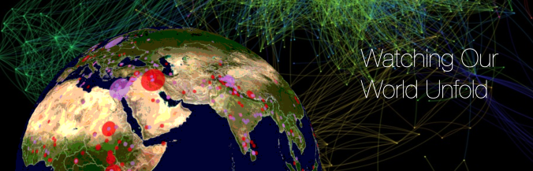
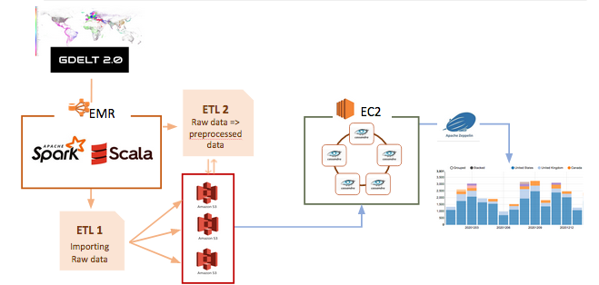
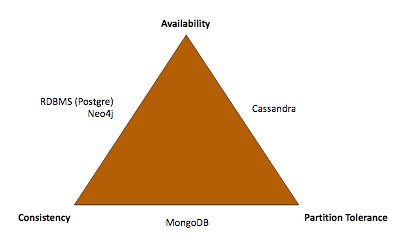
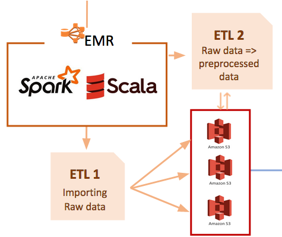
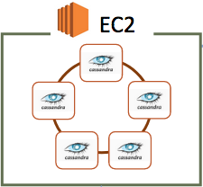
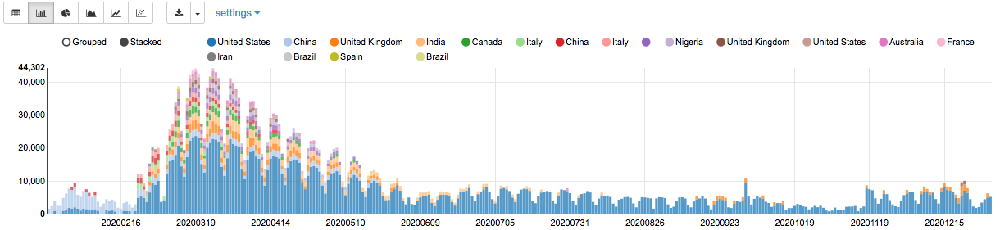
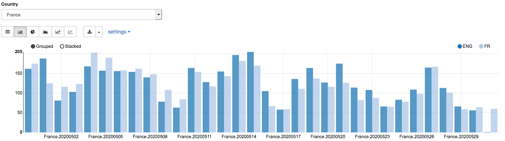
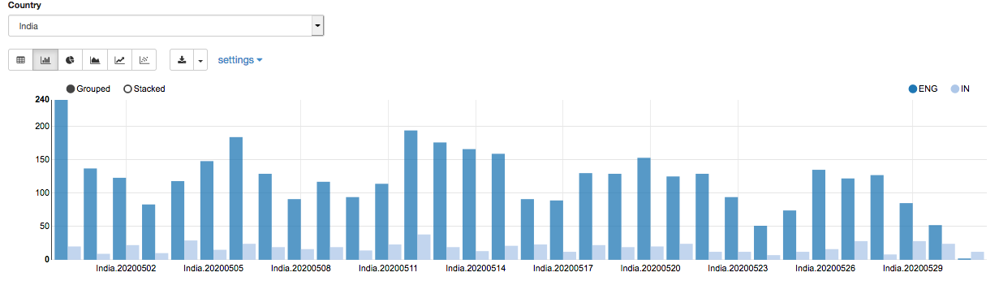
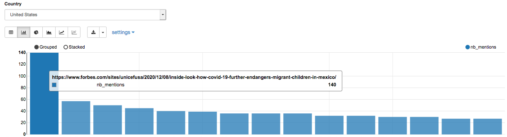

<p align="center">
  
</p>

<center>
  <h1>Gdelt - NoSQL Big data implementation from scratch</h1>
</center>

## Evolution de la pandémie COVID19 via son impact média

_Contributeurs : Vincent, Bardonnet, Alexandre Bréboin, Simon Delarue, Mathias Nourry, Valentin Pannier_

> _" The Global Database of Events, Language, and Tone (GDELT) monitors the world’s broadcast, print, and web news from nearly every corner of every country in over 100 languages and identifies the people, locations, organizations, themes, sources, emotions, counts, quotes, images and events driving our global society every second of every day, creating a free open platform for computing on the entire world_

**Objectif**

|L'objectif de ce projet est d'analyser l'évolution de la pandémie COVID, en fonction de la couverture médiatique associée. Pour cela, nous utilisons le jeu de données du **[projet Gdelt](https://blog.gdeltproject.org/gdelt-2-0-our-global-world-in-realtime/_)**.|
| --- |

### 1. Données

Le Gdelt Project vise à réunir les articles de presse du monde entier sous un même endroit. Au-delà d'un simple travail de récolte de données, ces dernières sont analysés pour produire des informations au sujet des thèmes, des sources, des lieux ou encore du ton de l'article.
In fine, 3 sources de données sont mises à disposition :
- export : données relatives à des publication
- mentions : données relatives aux mentions de chaque publication 
- gkg : données relatives aux lieux, acteurs et ton de chaque publication   

Ces 3 sources sont générées par intervalle de 15 minutes et sont indexées selon deux fichiers principaux :
- [Masterfile : English](http://data.gdeltproject.org/gdeltv2/masterfilelist.txt) : relatif aux publications écrites en anglais
- [Masterfile : Translation](http://data.gdeltproject.org/gdeltv2/masterfilelist-translation.txt) : relatif aux publications dans leur langue originale (hors anglais)

L'étude d'un an de données correspond à environ **500Go** à traiter. Les choix d'architecture pour l'analyse ont donc un impact majeur sur les performances finales du modèle !


### 2. Architecture

Pour répondre aux besoins de l'analyse, nous avons mis en place une architecture déployée sur **Amazon Web Services** (AWS), au travers de technologies distribuées comme **Spark** et d'une base de données NoSQL, **Cassandra**.

<p align="center">
  
</p>

***Choix de la techologie de base de données***

Le choix de la technologie de base de données s'est fait à partir du triangle CAP :
- ***C***onstistency
- ***A***vailability
- ***P***artition tolerance

<p align="center">
  
</p>

Le theorème CAP suggère qu'il faille faire un choix entre les trois caractéristiques de notre base.
Dans notre cas d'étude, nous avons décidé de ne pas sélectionner la caractéristique ***C***onsistency qui assure normalement de toujours obtenir des données à jour au moment d'une lecture de la base. En effet, les données stockées correspondront à l'année 2020 et représentent donc une image des données du Gdelt pour cette année. Les données stockées ne sont donc pas amenées à être modifiées.   
Au final on souhaite donc une technologie permettant : 
- une fault tolerance (accessibilité aux données malgré le fait que certains noeuds tombent) = ***P***artition tolerance 
- que le temps de requêtage soit relativement faible = ***A***vaibility


***DataLake : bucket S3 et ETLs via EMR***

<p align="center">
  
</p>

Se plaçant dans une configuration professionnelle, notre solution repose sur une distinction claire entre un DataLake accessible par des professionnels de la donnée, et un DataWarehouse disponible pour les applications métiers.

Le DataLake est représenté ici par un ensemble de compartiment S3 permettant de stocker :
- des fichiers de données brutes, directement extraites de la plateforme Gdelt
- des fichiers de données pré-traitées, issues d'un traitement des données brutes

La génération de ces deux formats de fichiers est effectuée sur la base de 2 ETLs exécutés sur des clusters EMR à partir de la technologie Spark.
Dans un soucis de coûts limités par nos comptes AWS Educate, nous avons fait le choix de disposer de 3 compartiments S3, chacun assurant la sauvegarde des données sur un horizon de 4 mois. Chaque bucket S3 peut ainsi être chargé en données brutes par un EMR qui lui est propre : on dispose ainsi de 3 EMR et de 3 compartiments S3. Chaque EMR a pour mission, sur son périmètre de 4 mois de données :
- de charger les données brutes au format *.zip* depuis la plateforme Gdelt vers le compartiment S3 qui lui est associé dans un dossier *Raw_data* (ETL 1)
- de pré-traiter ces données, afin de filtrer les données relatives au COVID-19 et de sélectionner les colonnes importantes, et de les charger dans un dossier *Processed_data* dans le compartiment S3 qui lui est associé au format *.parquet* (ETL 2)   

Chaque EMR est constitué de 7 machines m4.xlarge permettant une exécution rapide des ETLs. Une fois les ETL 1 et 2 effectués, les EMR sont résiliés.  

***DataWarehouse : EC2 - Cassandra***

<p align="center">
  
</p>

Le DataWarehouse consitute le lieux de stockage des données pré-traitées propre à l'application d'une business unit. Ces données sont directement destinées aux métiers et peuvent être analysées immédiatement. Dans notre cas cette business unit correspond à la recherche sur le COVID-19. Toutefois notre architecture permettrait d'instancier d'autres DataWarehouse destinés à d'autres business unit (juridique, marketing ...) en répliquant la partie EC2 - Cassandra.

Les configurations retenues pour l'instanciation de notre ring Cassandra sont les suivantes :

*Note* : Pour configurer cette architecture chez vous, suivez ce [Tutoriel Cassandra](https://github.com/MathiasNourry/Gdelt_project/tree/main/cassandra)

**Configurations**
* **EC2 instances** : M4Large 
* **Replication factor** = 3
* **Snitch** : Ec2Snitch   
Ce paramètre est optimal pour une utilisation du cluster au sein d'une même région (ce qui est une contrainte imposée par l'utilisation d'un compte AWS Educate).
* **Read/Write consistency** = ONE/LOCAL_QUORUM   
Ces choix nous permettent en effet d'offrir à l'utilisateur la possibilité de requêter les données si certains noeuds sont _down_, tout en assurant une consistance raisonnable au moment du chargement des données.
* **Load** ~1Go de données par noeud

<p align="center">
  
</p>

Les données **export** et **mentions** pour une année entière sont injectées dans 2 tables distinctes, permettant à l'utilisateur un requêtage simple et efficace.
Faute d'espace de stockage, les données **gkg** n'ont pas été chargées sur le ring Casssandra.


### 3. Zeppelin - Analyse des données

Les données sont à présent sur le ring Cassandra, et l'utilisateur peut y accéder en utilisant un **Notebook Zeppelin**, configuré spécifiquement pour dialoguer avec Cassandra (via l'installation d'un connecteur spark-cassandra).

Il existe deux façons distinctes d'obtenir les données :
- via `CQL` le langage de requête natif de Cassandra. Ce langage impose cependant des contraintes fortes sur la manipulation des données (notamment sur les agrégations et jointures)
- via `Spark-SQL`, en important les tables depuis Cassandra et en les injectant dans des _vues_ destinées à faciliter l'analyse. C'est cette méthode que nous retenons (exemple ci-dessous)
``` scala
val mentions_from_cass = spark.read.cassandraFormat("mentions", "gdelt_project").load()
mentions_from_cass.createOrReplaceTempView("mentions")
```

<p align="center">
  
</p>

**Nombre d'événements médiatiques relatifs au COVID, par date et pays**

Il peut être intéressant d'observer l'évolution du nombre d'articles relatifs au COVID sur l'année 2020, en détaillant par pays d'origine de l'article.  
On note qu'avant le mois de mars, la couverture médiatique était relativement basse, et principalement concentrée sur la Chine. Après le début de la "première vague", tous les pays - et majortairement les US - ont participé à la production d'articles.

``` sql
select country
    ,days
    ,count(globaleventid) as nb_event 
from export
where country <> "null"
group by
    country
    ,days
order by nb_event desc
```

<p align="center">
  
</p>

**Nombre d'événements médiatiques relatifs au COVID, par pays et par langue**

En observant le nombre d'articles relatifs au COVID par pays et par langue, on peut noter les différences de proportion dans les langues utilisées pour la production d'articles ; ci-dessous des exemples pour la France et l'Inde.

``` sql
select country
    ,days
    ,language
    ,count(globaleventid) as nb_event 
from export
where country="${Country=France,Belgium|France|Canada|China|Germany|Italy|India|Mexico|Spain|United States|United Kingdom}"
    and days <= 20200531
    and days >= 20200430
group by
    country
    ,days
    ,language
order by nb_event desc
```
<p align="center">
  
</p>

<p align="center">
  
</p>

**Nombre de mentions des évenements, par pays**

Finalement, au delà du nombre d'articles relatifs au COVID publiés dans une région, nous pouvons regarder les événements qui ont suscité le plus de mentions dans d'autres sources d'information.

``` sql
select export.url, count(mentions.mention) as nb_mentions
from export as export
left join mentions as mentions
    on export.url = mentions.mention
where export.country = "${Country=United States,Belgium|France|Canada|China|Germany|Italy|India|Mexico|Spain|United States|United Kingdom}"
    and days = "20201208"
group by export.url
order by nb_mentions desc
limit 15
```

<p align="center">
  
</p>

### 4. Limites et contraintes du modèle

Le modèle présenté soulève quelques limites et contraintes

**Cassandra**

Bien que permettant de respecter nos objectifs de disponibilité et de tolérance aux pannes, Cassandra impose une rigidité dans les structures des tables et des requêtes (jointures, et agrégations moins souples qu'en SQL). Pour faciliter la tâche de l'utilisateur, nous avons fait le choix de créer des vues spark-sql sur la base des données requêtées dans Cassandra.

**Gdelt**

L'analyse des données est à prendre dans son ensemble, sans faire de focus précis sur les éléments, en effet :
- le filtre que nous appliquons sur l'url ne tient pas compte des articles référencés par un numéro &rarr; sous-estimation du nombre d'événements liés au COVID
- nous ne traitons pas les données de pays manquantes &rarr; sous-estimation du nombre d'événements pour certaines régions

**Compte AWS Educate**

Finalement, une des contraintes les plus forte à été liée au compte AWS lui-même :
- la limite de ressources machines disponible (32 CPUs) a augmenté les temps de traitements et les capacités de stockage
- l'impossibilité de partager les ressources budgétaires (100$ par personne) nous a contraint a paralléliser les downloads et ETL dans le groupe, afin de mener à bien le projet (dont le coût a dépassé 100$)
- le manque d'espace de stockage dans les choix de notre architecture ne nous a pas permit d'intégrer les données gkg dans le ring Cassandra
