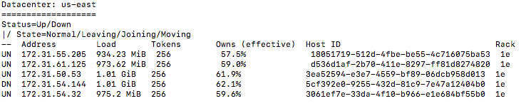
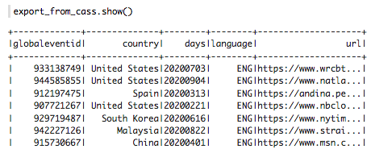

<p align="center">
  
</p>

<center>
  <h1>Gdelt - NoSQL Big data implementation from scratch</h1>
</center>

## Study of the evolution of the COVID19 pandemic via its media impact

_Contributors : Vincent Bardonnet, Alexandre Bréboin, Simon Delarue, Mathias Nourry, Valentin Pannier_

> _" The Global Database of Events, Language, and Tone (GDELT) monitors the world’s broadcast, print, and web news from nearly every corner of every country in over 100 languages and identifies the people, locations, organizations, themes, sources, emotions, counts, quotes, images and events driving our global society every second of every day, creating a free open platform for computing on the entire world_

**Goal**

|The goal of this project is to analyze the evolution of the COVID pandemic, according to the associated media coverage. For this, we use the dataset of the  **[Gdelt project](https://blog.gdeltproject.org/gdelt-2-0-our-global-world-in-realtime/_)**.|
| --- |

### 1. Data

The Gdelt Project aims to gather news articles from all over the world in one place. Beyond the simple task of collecting data, the data is analyzed to produce information about the topics, sources, locations and tone of the article.
In fine, 3 sources of data are available :
- export : data related to publications
- mentions : data related to the mentions of each publication 
- gkg : data related to the places, actors and tone of each publication   

These 3 sources are generated at 15 minute intervals and are indexed according to two main files:
- [Masterfile : English](http://data.gdeltproject.org/gdeltv2/masterfilelist.txt) : about publications written in English
- [Masterfile : Translation](http://data.gdeltproject.org/gdeltv2/masterfilelist-translation.txt) : about publications in their original language (except English)

The study of one year's amount of data corresponds to about **500Go** to process. The choice of architecture for the analysis therefore has a major impact on the final performance of the model!


### 2. Architecture

To answer the needs of the analysis, we set up an architecture deployed on **Amazon Web Services** (AWS), through distributed technologies like **Spark** and a NoSQL database, **Cassandra**.

<p align="center">
  
</p>

**Choice of database technology**

The choice of the database technology was based on the CAP triangle:
- **C**onstistency
- **A**vailability
- **P**artition tolerance

<p align="center">
  
</p>

The CAP theorem suggests that a choice must be made between the three characteristics of our database.
In our case study, we decided to not select the **C**onsistency feature which normally ensures that we always get up-to-date data when reading the database. Indeed, the stored data will correspond to the year 2020 and thus represent an image of the Gdelt data for this year. The stored data will not be modified.
In the end, we want a technology that allows : 
- fault tolerance (data accessibility despite the fact that some nodes fall down) = **P**artition tolerance 
- that the query time is relatively low = **A**vaibility


***DataLake : bucket S3 and ETLs via EMR***

<p align="center">
  
</p>

Our solution is based on a clear distinction between a DataLake, accessible by data professionals, and a DataWarehouse, available for business applications.

The DataLake is represented here by a set of S3 compartments allowing to store :
- raw data files, directly extracted from the Gdelt platform
- pre-processed data files, resulting from the processing of raw data

The generation of these two file formats is done on the basis of 2 ETLs executed on EMR clusters using Spark technology.
In order to keep costs down with our AWS Educate accounts, we have chosen to have 3 S3 buckets, each one ensuring the storage of data over a 4-month period. Each S3 bucket can be loaded with raw data by its own EMR: we thus have 3 EMRs and 3 S3 compartments. Each EMR's mission, within its 4-month data perimeter, is to:
- to load the raw data in *.zip* format from the Gdelt platform to its associated S3 compartment in a *Raw_data* folder (ETL 1)
- to pre-process these data, in order to filter the data related to COVID-19, to select the important columns and to load them in a *Processed_data* folder in the associated S3 compartment in *.parquet* format (ETL 2)   

Each EMR consists of 7 m4.xlarge machines allowing fast execution of ETLs. Once ETL 1 and 2 are completed, the EMRs are terminated. 


***DataWarehouse : EC2 - Cassandra***

<p align="center">
  
</p>

The DataWarehouse is the storage place for pre-processed data specific to a business unit's application. These data are directly intended for the business units and can be analyzed immediately. In our case, this business unit corresponds to research on COVID-19. However, our architecture would allow us to instantiate other DataWarehouses intended for other business units (legal, marketing, etc.) by replicating the EC2 - Cassandra part with the appropriate data.

The configurations chosen for the instantiation of our Cassandra ring are the following :

*Note*: To configure this architecture at home, follow this [Tutoriel Cassandra](https://github.com/MathiasNourry/Gdelt_project/tree/main/cassandra)

**Configurations**
* **EC2 instances** : M4Large 
* **Replication factor** = 3
* **Snitch** : Ec2Snitch 
This setting is optimal for cluster use within the same region (which is a constraint imposed by the use of an AWS Educate account).
* **Read/Write consistency** = ONE/LOCAL_QUORUM
These choices allow us to offer the user the possibility to query the data if some nodes are _down_, while ensuring a reasonable consistency when loading the data.
* **Load** ~1Go of data per node

<p align="center">
  
</p>

The **export** and **mentions** data for a whole year are injected in 2 distinct tables, allowing the user a simple and efficient query.
Due to lack of storage space, the **gkg** data have not been loaded on the Casssandra ring.


### 3. Zeppelin - Data Analysis

The data is now on the Cassandra ring, and the user can access it using a **Notebook Zeppelin**, specifically configured to talk to Cassandra (via the installation of a spark-cassandra connector).

There are two distinct ways to get the data:
- via `CQL` the native query language of Cassandra. However, this language imposes strong constraints on data manipulation (especially on aggregations and joins)
- via `Spark-SQL`, by importing the tables from Cassandra and injecting them into _views_ intended to facilitate the analysis. This is the method we use (example below)
``` scala
val mentions_from_cass = spark.read.cassandraFormat("mentions", "gdelt_project").load()
mentions_from_cass.createOrReplaceTempView("mentions")
```

<p align="center">
  
</p>

**Number of media events related to COVID, by date and country**

It may be interesting to observe the evolution of the number of articles related to COVID over the year 2020, breaking down by country of origin of the article.  
We note that before March, media coverage was relatively low, and mainly concentrated on China. After the start of the "first wave", all countries - and mainly the US - participated in the production of articles.

``` sql
SELECT country,
       days,
       count(globaleventid) AS nb_event 
FROM export
WHERE country <> "null"
GROUP BY country,
         days
ORDER BY nb_event DESC
```

<p align="center">
  
</p>

**Number of media events related to COVID, by country and language**

Looking at the number of COVID-related articles by country and language, we can note the differences in the proportion of languages used for article production; below are examples for France and India.

``` sql
SELECT country,
       days,
       language,
       count(globaleventid) AS nb_event 
FROM export
WHERE country="${Country=France,Belgium|France|Canada|China|Germany|Italy|India|Mexico|Spain|United States|United Kingdom}"
      AND days <= 20200531
      AND days >= 20200430
GROUP BY country,
         days,
         language
ORDER BY nb_event DESC
```

<p align="center">
  
</p>

<p align="center">
  
</p>

**Number of mentions of events, by country**

Finally, beyond the number of COVID-related articles published in a region, we can look at the events that generated the most mentions in other news sources.

``` sql
SELECT export.url, 
       count(mentions.mention) AS nb_mentions
FROM export AS export
LEFT JOIN mentions AS mentions
          ON export.url = mentions.mention
WHERE export.country = "${Country=United States,Belgium|France|Canada|China|Germany|Italy|India|Mexico|Spain|United States|United Kingdom}"
      AND days = "20201208"
GROUP BY export.url
ORDER BY nb_mentions DESC
LIMIT 15
```

<p align="center">
  
</p>


### 4. Limitations and constraints of the model

The model presented raises some limitations and constraints :

**Cassandra**

Although Cassandra allows us to respect our availability and fault tolerance objectives, it imposes a rigidity in the table and query structures (joins and aggregations are less flexible than in SQL). To facilitate the user's task, we have chosen to create spark-sql views on the basis of the data queried in Cassandra.

**Gdelt**

The analysis of the data is to be taken as a whole, without making a precise focus on the items, indeed :
- the filter we apply on the url does not take into account the items referenced by a number &rarr; underestimation of the number of events related to COVID
- we do not process missing country data &rarr; underestimation of the number of events for some regions

**AWS Educate account**

Finally, one of the strongest constraints was related to the AWS account itself:
- the limit of available machine resources (32 vCPUs) increased processing times and storage capacities
- the impossibility of sharing budget resources ($100 per person) forced us to parallelize the downloads and ETL in the group, in order to complete the project (whose cost exceeded $100 including the various test phases)
- the lack of storage space in our architecture choices did not allow us to integrate the gkg data in the Cassandra ring