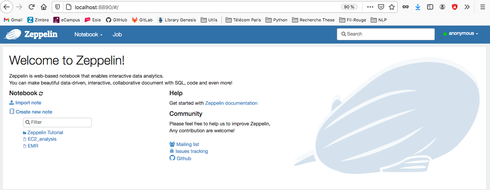
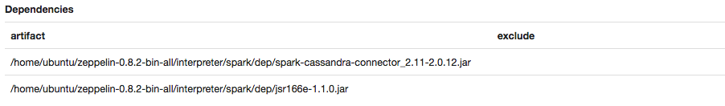

# Apache Zeppelin - Cassandra

Zeppelin Notebook offre un environnement très pratique pour l'analyse de données. Plusieurs connecteurs et interpréteurs modulables peuvent être ajoutés, afin d'utiliser Spark, SQL, Scala ou encore Cassandra.

Nous utiliserons la version `0.8.2`, qui assure la compatibilité avec la version de Cassandra utilisée dans la partie environnement NoSQL.

__Connexion aux instances__

Se connecter à l'instance EC2 (Ubuntu 18 dans notre cas) sur laquelle installer Apache Zeppelin via un tunnel `ssh`, en redirigeant le port d'écoute pour permettre d'accéder au notebook via un navigateur web local.
``` shell
ssh -L 8890:127.0.0.1:8080 -i \<chemin-vers-keyPair.pem\> ubuntu@\<DNS-address-of-master\>
```

> _On redirige le port `8080` de l'instance EC2 vers le port `8890` de la machine locale._

## Requêter le ring Cassandra via Apache Zeppelin

Dans les étapes qui suivent, Zeppelin est installé sur l'une des instances contenant cassandra, et le cluster Cassandra contient 3 noeuds. Zeppelin utilise la version native de spark (disponible depuis les packages zeppelin), et pas un cluster spark déployé from scratch.

_[Edit] : les configurations du notebook zeppelin peuvent être faite sur une version locale (plutôt que sur une instance EC2)._ 

#### Zeppelin

Pour effectuer des requêtes sur le ring cassandra, on va utiliser un notebook Zeppelin configuré avec un **connecteur spark-cassandra**.

__Install__

Pour installer Zeppelin, on télécharge les paquets depuis l'adresse suivante.

``` shell
wget https://downloads.apache.org/zeppelin/zeppelin-0.8.2/zeppelin-0.8.2-bin-all.tgz
tar xzf zeppelin-0.8.2-bin-all.tgz
rm zeppelin-0.8.2-bin-all.tgz
```

__Launch__
Démarrer le daemon Zeppelin sur l'instance EC2
``` shell
cd zeppelin-0.8.2-bin-all/bin/
./zeppelin-daemon.sh start
```

__Connect__
La redirection du port d'écoute a été faite au moment de la connexion à l'instance EC2. Il suffit donc d'aller dans un navigateur et de rentrer l'addresse
``` shell
localhost:8890
```


> **Bravo !** Apache Zeppelin est installé. En revanche, il s'agit à présent de configurer la connexion avec cassandra.

### Connect Zeppelin to Cassandra

_**Note** : Dans le cas d'une connexion depuis un poste local sur le ring cassandra (stocké sur un cluster EC2), il faudra remplacer les IP privées des noeuds du cluster, par les IP **publiques**_.

Pré-requis

- Installer java 8

Optionnel
- Installer cassandra

Il s'agit de modifier les configurations du `Interpreter menu` de Zeppelin (cliquer sur la roue de configuration en haut à droit de la page du notebook zeppelin) afin de faire le lien entre le cluster cassandra et le notebook utilisé.

__Spark interpreter__

Sélectionner l'interpréteur spark grâce à la barre de recherche du menu interpreter, et effectuer les modifications suivantes :
1) Ajouter un pointeur vers la liste des adresses IP privées du cluster cassandra en créant une nouvelle ligne contenant
  ```
  spark.cassandra.connection.host           <IP cassandra>
  ```
2) Ajouter le connecteur Spark-Cassandra comme dépendance dans l'interpréteur. Les chemins peuvent être modifiés selon le système d'exploitation utilisé (voir ci-dessous pour le répertoire où copier les `.jar`). Dans tous les cas, inscrire le chemin **complet**.


Si les dépendances ne sont pas disponibles, télécharger les jar aux adresses

* https://mvnrepository.com/artifact/com.datastax.spark/spark-cassandra-connector_2.11/2.0.12
* https://mvnrepository.com/artifact/com.twitter/jsr166e/1.1.0

ou directement par commande sur les machines du cluster (le répertoire `interpreter` est situé dans le dossier `zeppelin` téléchargé via fichiers binaires).

``` shell
cd ~/zeppelin-0.8.2-bin-all/interpreter/spark/dep
wget https://repo1.maven.org/maven2/com/datastax/spark/spark-cassandra-connector_2.11/2.0.12/spark-cassandra-connector_2.11-2.0.12.jar
wget https://repo1.maven.org/maven2/com/twitter/jsr166e/1.1.0/jsr166e-1.1.0.jar
```
_Note : cliquer sur le bouton "+" à droite des ajouts afin que l'interpréteur prenne bien les modifications en compte._

__Cassandra interpreter__

Sélectionner l'interpréteur cassandra grâce à la barre de recherche du menu interpreter et ajouter un pointeur vers la liste des adresses IP privées du cluster cassandra en créant la ligne
  ```
  cassandra.hosts           <IP cassandra>
  ```

__Librairires__

Pour finaliser la connexion entre spark et cassandra, dans une cellule du notebook, importer les librairies relatives aux connecteurs installés :
``` scala
import com.datastax.spark.connector._
import org.apache.spark.sql.cassandra._
```


> **Et voilà !** Apache Zeppelin est installé et configuré pour communiquer avec votre ring Cassandra.